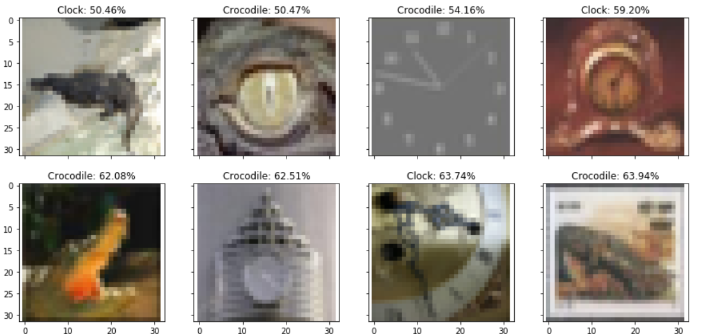

# samsung-task
ML task for Samsung internship 2018

## Задача 1

Построить классификатор, разделяющий изображения крокодила и часов

## Отчет

### 1.1

Для предсказания класса по картинке была использована сверточная нейросеть из 12 слоев с использованием библиотеки Keras с бзк-эндом Tensorflow:
- 2 слоя свертки
- слой объединения(Pooling Layer)
- отсеивающий слой(от переобучения)(Dropout layer)

- 2 слоя свертки
- слой объединения(Pooling Layer)
- отсеивающий слой(от переобучения)(Dropout layer)

- сглаживающий слой(Flatten layer)
- полносвязный слой
- полносвязный слой с сигмоидой

accuracy на обучаемом множестве: 98.95% и
accuracy на тестовом множестве: 92%
Пытался еще улучшить результаты, но тщетно. Свалим вину на малый разбер предоставленной выборки, всего 1000 объектов.

Подробнее см. [task1/train.ipynb](task1/train.ipynb)

### 1.2

Были найдены картинки наиболее похожие и на крокодила, и на часы одновременно, предпологая, что сеть выдает заведомо правильный ответ

Подробнее см. [task1/usage.ipynb](task1/usage.ipynb)

### 1.3

Попытался создать картинку максимально похожую и на часы и крокодила, используя автоенкодер. Даже получилось обмануть сеть, она выдала вероятность ровно 50% ринадлежности к крокодилу и часам. Но визуально картинка тоже не очень разборчива.

Подробнее см. [task1/usage.ipynb](task1/usage.ipynb)

## Задача 2

Построить классификатор, который может определить кому принадлежит данный
отрезок текста: Гоголю или Гегелю.

## Отчет

Для классификации было решено использовать логистическую регрессию в связке с tf-idf кодированием для одного слова и пары слов, поскольку для классификации текста на 2 кластера этого вполне достаточно и точно не нужно усложнять модель нейросетями.

### Подготовка данных

Были выбраны произольные произведения Гоголя и Гелеля, которые в дальнецшем делились на небольшие выборки по несколько предложений. Далее выборки:
- приводились к нижнему регистру
- убиралась пунктуация
- фильтровались стоп слова и слова не из алфавита
- все слова в выборке преобразовывались в коренные

Позже данные сохранялись в файл [data.csv](task2/data/data.csv)
Подробнее см. [task2/prepare_data.ipynb](task2/prepare_data.ipynb)

### Модель

Данные из [data.csv](task2/data/data.csv) преобразовывались в tf-idf матрицу.
Далее с помощью GridSearchCV находились лушкие параметры для логистической регрессии с L2 регулязацией.
После этого модель училась и тестировалась.

ROC-AUC на обучаемом множестве: 99.61% и
ROC-AUC на тестовом множестве: 99.75%

ROC-AUC выглядит не очень интересно

На отрывках других произведений модель также имела отличные предсказания
Подробнее см. [task2/train.ipynb](task2/train.ipynb)

